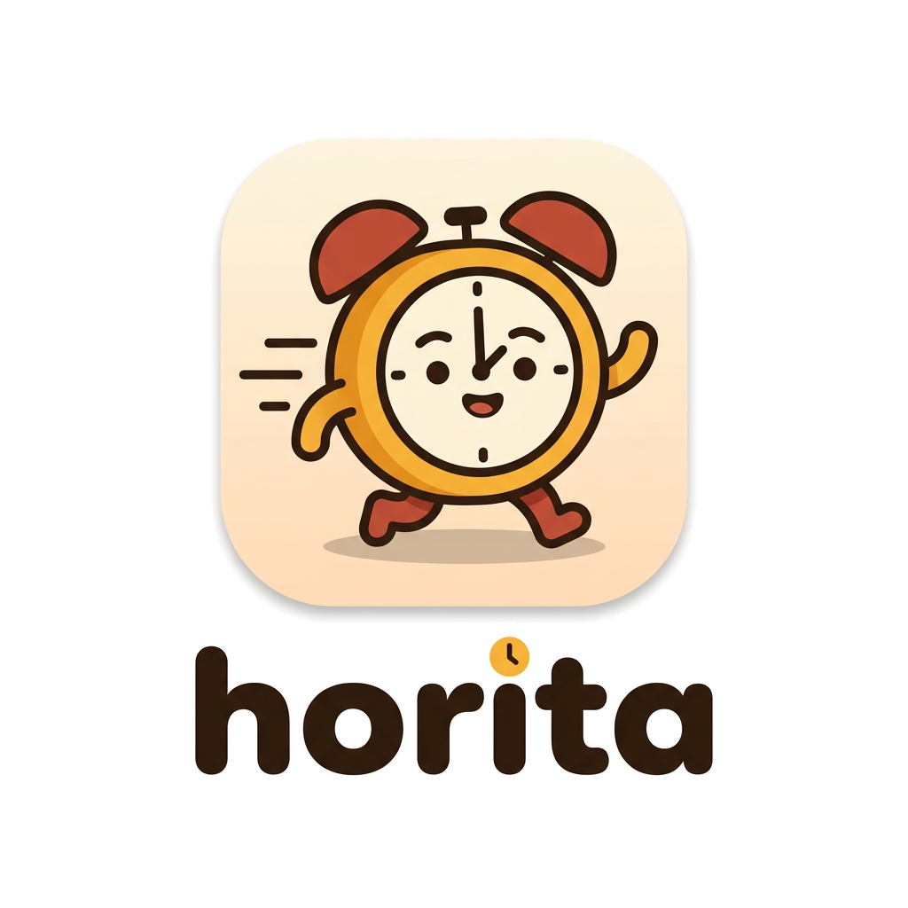
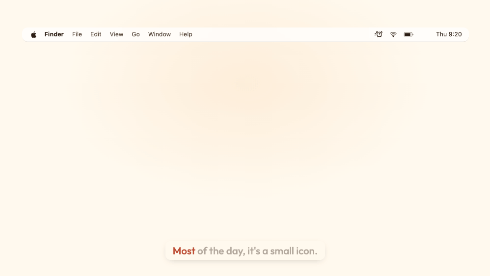
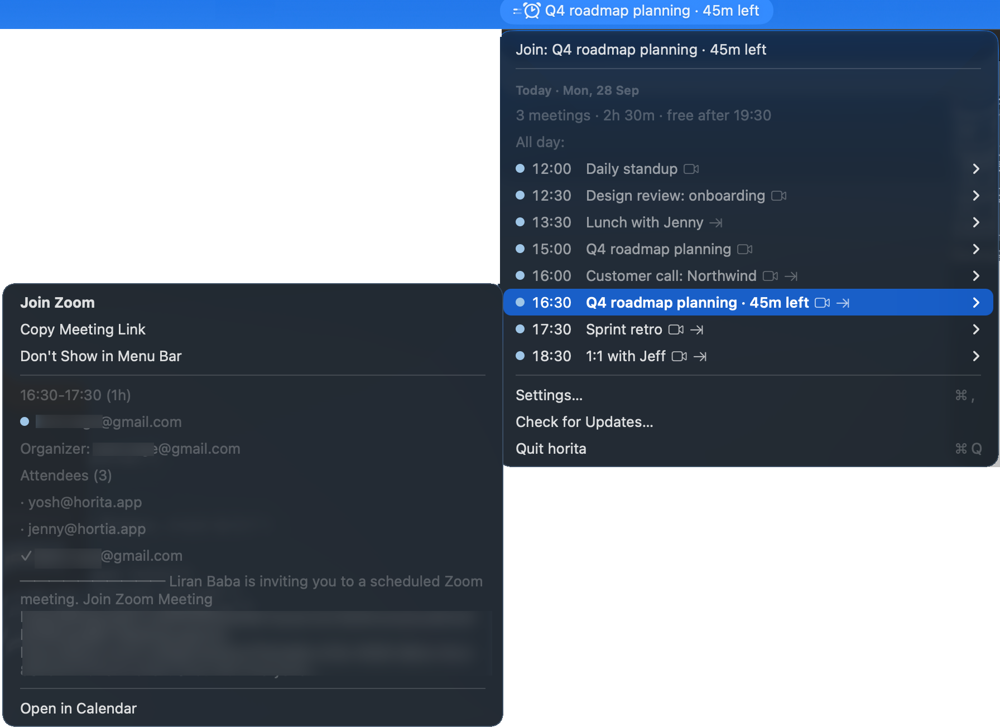
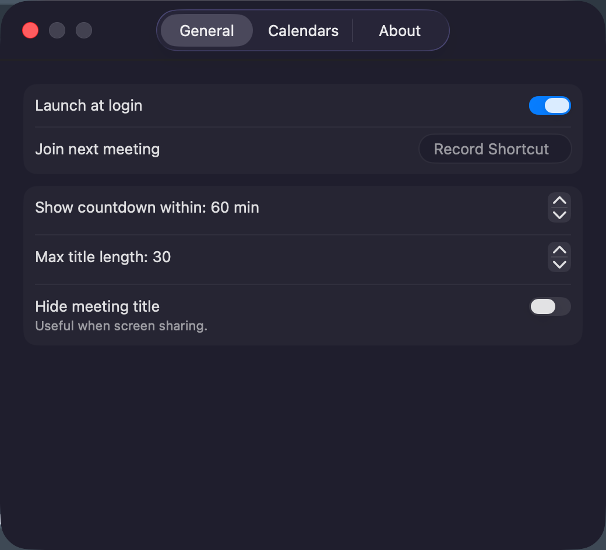

<p align="center">
  <picture>
    <source media="(prefers-color-scheme: dark)" srcset=".github/branding/horita-logo-dark.png">
    
  </picture>
</p>

<p align="center"><strong>Your next meeting, in the menu bar.</strong></p>

<p align="center">
  <a href="https://github.com/cordwainersmith/horita/releases/latest"></a>
  
  
  <a href="LICENSE"></a>
</p>

<p align="center"></p>

<p align="center">
  <a href="https://dl.horita.app/latest/Horita.dmg"><strong>Download for Mac</strong></a>
  &nbsp;·&nbsp;
  <a href="https://horita.app">horita.app</a>
</p>

horita is a small Mac app that answers one question without making you open anything: what's next, and how long do I have? When it's time, one click gets you into the call.

It isn't a calendar app and doesn't want to be. It reads the calendars your Mac already has, shows you the next thing, and stays out of the way the rest of the time.

## Install

You'll need macOS 14 (Sonoma) or newer.

1. [Download horita](https://dl.horita.app/latest/Horita.dmg) and open the DMG.
2. Drag horita into Applications, then open it from there.
3. Allow calendar access when macOS asks.

horita lives in the menu bar, so there's no Dock icon and no window. It keeps itself up to date.

Prefer Homebrew?

```
brew install --cask cordwainersmith/tap/horita
```

## What it does

The countdown only shows up when a meeting is getting close. You decide how close. Until then it's just a small icon.

Click it and you get the rest of today in a plain dropdown. Hover a meeting for the details: where it is, who organized it, who's coming.

<p align="center"></p>

A line under Today sums up the day: how many meetings, how much of it is busy, and when you're free. Meetings that overlap or run back-to-back are marked, and once today is done you'll see tomorrow's first meeting. While a meeting is running, the menu bar icon fills in to show how far along it is.

Don't need a recurring meeting in the menu bar title? Hide it from its details. It stays in the dropdown.

Zoom, Google Meet and Microsoft Teams links are picked up automatically. Right-click the menu bar item to jump straight into the next call, or record a keyboard shortcut if you'd rather not reach for the mouse.

Want a nudge before a meeting starts? Turn on reminders and pick a banner with a Join button, or a full-screen reminder you can't miss, with Join, Snooze and Dismiss. They're off by default.

Sharing your screen? There's a setting to hide meeting titles, so your 3pm stays between you and your calendar.

<p align="center"></p>

It works with any calendar you've added to your Mac: iCloud, Google, Exchange, whatever shows up in the Calendar app. You choose which ones horita pays attention to.

## Privacy

Your calendar is read on your Mac and it stays there. horita has no account to sign up for and collects nothing about you.

The one thing it does online is check for new versions of itself. Those checks and downloads go through `dl.horita.app`, which keeps anonymous counts, just which version and whether it was a download or an update. It doesn't store IP addresses or anything that identifies you. The details are in the [privacy policy](https://horita.app/privacy).

The code is open so you don't have to take that on faith.

## Questions

**horita says it can't see my calendars.**
Open System Settings > Privacy & Security > Calendars and turn horita on.

**A calendar is missing.**
horita sees the calendars in the Calendar app. Add the account in System Settings > Internet Accounts, then switch the calendar on in horita's Settings > Calendars.

**I can't see horita in the menu bar.**
On a MacBook with a notch, menu bar items that don't fit get hidden behind it. Quit a few other menu bar apps or use a menu bar manager to make room. On macOS 26, also check that horita is allowed in System Settings > Menu Bar.

**How is this different from MeetingBar?**
MeetingBar is a great app and does more: it knows over 50 meeting services and has lots of options. horita does less on purpose. It stays a small icon until a meeting is close, sums up your day in one line, marks overlapping meetings, and can hide titles while you share your screen. If you join Webex or Discord calls, MeetingBar is the better pick.

**How do I quit it?**
Click the menu bar item and choose Quit horita at the bottom of the dropdown.

**How do updates work?**
horita checks once a day and asks before installing anything. You can also choose Check for Updates… from the dropdown.

## What's next

A direct Google Calendar connection, for calendars your Mac can't see, like a work Google account you never added to System Settings. It will talk to your own Google account and nothing else.

## License

MIT. See [LICENSE](LICENSE). Third-party licenses are in [App/Acknowledgements.txt](App/Acknowledgements.txt).

The horita name and logo are not covered by the MIT license and may not be used for apps derived from this code.
